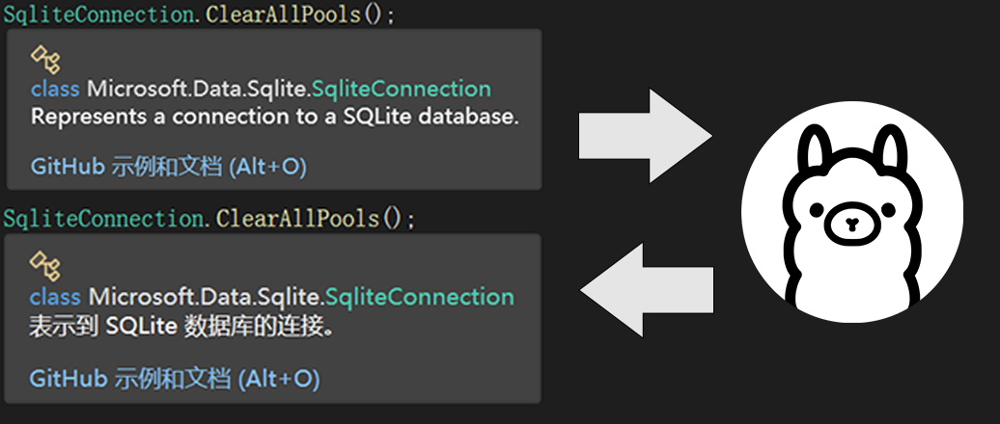
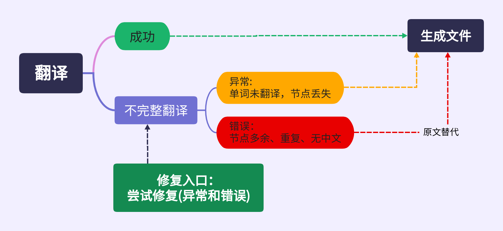
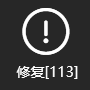

# 简介
使用大模型翻译.net xml 文档。支持ollama、智谱AI、DeepSeek 或兼容OpenAi接口的服务。
 

## 使用步骤
1. 安装 ollama。
1. 下载模型。
1. 下载 zhapi : https://gitee.com/84819760/zh-api/releases/latest
1. 在配置中使用模型。
1. 执行翻译。

# 安装 ollama 

(建议使用迅雷等下载工具)   
下载1: https://ollama.com/download/OllamaSetup.exe    
下载2: https://github.com/ollama/ollama/releases/latest/download/OllamaSetup.exe     

- ollama要求0.9.0及以上版本
- 建议至少8G显存，显卡支持列表: https://github.com/ollama/ollama/blob/main/docs/gpu.md   
- 没有显卡的情况下CPU也可以用，不过太慢，建议配置DeepSeek或兼容OpenAi接口的网络模型服务(调用会产生费用)。

> 优先考虑官方版本，特殊情况下使用专用版(未作测试)。      

- amd 专用版: https://github.com/likelovewant/ollama-for-amd     
- intel GPU专用版: https://github.com/intel/ipex-llm    

## 模型
并非所有的模型都适合翻译任务，影响速度的因素(显卡性能、提示词、模型选项，输入内容等)，测试数据如下：

(dbs\测试1k.7z) 测试总数: 1000。显卡RTX 2060 8G显存。

- 异常 : 单词未翻译，see 节点丢失。
- 失败 : 全部单词未翻译，see 节点重复或多余，其它错误。
- 异常比例 ： (异常 + 失败) / 测试总数。

模型名称             |异常   |失败  |异常比例 |耗时
---                 | ---   | --- | ---   | ---
qwen3:4b            |136    |28   |16.4%  |7.1m
gemma3:4b           |193    |5    |19.8%  |7.6m
qwen2.5:7b          |94     |2    |9.6%   |9.1m
DeepSeek-R1-0528:8b |47     |7    |5.4%   |11.2m
falcon3:8b          |91     |6    |9.7%   |15.2m
qwen3:8b            |73     |15   |8.8%   |16.5m
llama3.1:8b         |104    |21   |12.5%  |17.1m
GLM4-0414:9b        |25     |3    |2.8%   |19.8m
granite3.3:8b       |34     |8    |4.2%   |21.5m
cogito:8b           |92     |10   |10.2%  |23.9m

## 下载模型
在命令行(cmd)中执行
```
ollama pull 模型名称
或
ollama run 模型名称
```
> 例如 qwen3:4b 键入: ollama pull qwen3:4b
```bat
C:\Users>ollama pull qwen3:4b
pulling manifest
pulling 163553aea1b1: 100% ▕███████████████████████████████▏ 2.6 GB
pulling ae370d884f10: 100% ▕███████████████████████████████▏ 1.7 KB
pulling d18a5cc71b84: 100% ▕███████████████████████████████▏  11 KB
pulling cff3f395ef37: 100% ▕███████████████████████████████▏  120 B
pulling 5efd52d6d9f2: 100% ▕███████████████████████████████▏  487 B
verifying sha256 digest
writing manifest
success
```

# 配置
> zhapi 目录和配置文件，在第一次运行时生成。    

配置文件 : `\zhapi\app_config.jsonc`
```json5
{
  // 翻译服务列表(详情：翻译服务和修复列表配置)
  "services": [ ... ],

  // 对数据库中不完整的翻译进行修复(节点丢失等内容)
  // 配置方式与 services 相同
  "repair": [ ... ],

  // 修复筛选
  "repairCondition": {
    // 按评分值筛选。格式: [开始..结束], 以下表示大于等于5
    "scoreRange": "[5..]",
    // 按修复次数筛选。格式: [开始..结束], 以下表示3次及以下
    "repairRange": "[..3]"
  },

  // (全局)超时设置(每个服务可单独设置)
  // 设置过小时会丢弃长文本的翻译。
  "timeout": 60,

  // (全局)并发数量(每个服务可单独设置)
  // 显卡性能较差时可设置为2，使用CPU时建议设置为1。
  // 注意：在本地ollama模式和OpenAi（以及OpenAi派生模式Bigmodel, DeepSeek）混用时应考虑分开设置parallelism。
  // 避免全局parallelism设置过大导致本地ollama模式下的显卡性能下降。
  "parallelism":4,

  // (全局)按字符串长度总数拆分队列(每个服务可单独设置)，单个字符串超出长度的节点会被忽略。
  // Ollama默认值5000，DeepSeek和OpenAI默认值0。设置为0时停用。
  // 用于解决并发时多个超大字符串进入模型导致的超时。可根据显卡性能适当调整。
  "maxLength":5000,

  // 扫描XML文件的目录 例如(nuget缓存、.NET packs)等目录
  "directorys": [
    "%ProgramFiles%\\dotnet\\packs\\",
    "%UserProFile%\\.nuget\\packages\\",
    "%ProgramFiles(x86)%\\Microsoft SDKs\\"
  ],

  // 要忽略的文件，用于屏蔽不常用的大文件
  "ignores": [
  "\\microsoft.netcore.app.ref\\ * \\System.Runtime.Intrinsics.Xml",

  // 不做移动端开发时，添加以下文件
  "Mono.Android.xml",
  "Microsoft.iOS.xml",
  "Microsoft.MacCatalyst.xml"
  ]
}
```

### 翻译服务和修复列表配置
字段 | 描述
-- | -- 
type | 翻译服务类型，可选： Ollama, Bigmodel, DeepSeek, OpenAI
title | 软件中显示的名称 | 
model | 模型名称， Ollama 和 OpenAI 中必须指定
target |默认(all), word(单词未翻译), node(节点丢失), fail(无中文、节点重复、多余), all
enable | 是否启用 。

可选：timeout，parallelism，maxLength。   
其它设置可以在运行时通过日志(zhapi\logs)查看。     

---

#### Ollama 配置     
```json
{
  "services": [ 
    {
      "type": "ollama",
      // "url":  "默认值: http://localhost:11434",
      "title": "待翻译",
      "model": "qwen3:4b",
      "enable": true
    }
  ],
  //...
}
```
#### 智谱AI  配置  
```json
{
    "services": [
    {
      "type": "Bigmodel",   
      // 申请地址 https://www.bigmodel.cn
      "apikey" : "--必填--",
      //"model" : "默认值: glm-4-flash"
      "enable": true
    }
  ],
}
```

#### DeepSeek  配置     
```json
{
  "services": [ 
    {
      "type": "DeepSeek",
      // 申请地址 : https://platform.deepseek.com/api_keys
      "apikey" : "--必填--",
      // 并发请求数量，如果官网反应慢可适当提高
      //"parallelism" : 32,
      "enable": true
    }
  ],
  //...
}
```
#### OpenAI  配置       
```json
{
  "services": [ 
    {
      "type": "OpenAI",
      "url" : "https://xxx.xxx.xxx",
      "apikey" : "--必填--",
      // 并发请求数量，如果官网反应慢可适当提高
      //"parallelism" : 32,
      "model" : "gpt-4o",
      "enable": true
    }
  ],
  //...
}
```
#### 多服务 配置      
```json
{
  "services": [ 
    // 第一个服务选择 速度快的模型。
    {
      "type": "ollama",
      "title": "待翻译",
      "model": "qwen3:4b 或 gemma3:4b",
      "enable": true
    },

    // 第二个服务选择 参数更多的模型。
    {
      "type": "ollama",
      "title": "重试",
      "model": "qwen3:8b 或 llama3.1:8b",   

      // 重试策略
      "retry": {
        // 重试次数(无论成功还是失败)
        "max": 5,
        // 重复内容限制, 默认值:2(模型返回相同的结果，那么继续重试的意义不大)
        // "repeat": 2,
        // 是否启用对话模式重试, 默认值:true
        // "chat" :true
      },

      // 只处理 节点丢失 和 翻译错误的内容
      "target": "node, fail",
      "enable": true
    },

    // 第三个服务选择 网络模型(请求会产生费用)。
    {
      "type": "DeepSeek",
      "apikey" : "--必填--",
      // 只处理 翻译错误的内容
      "target": "fail",
      // 并发请求数量，如果官网反应慢可适当提高
      "parallelism" : 32,
      // 超时（单位秒）
      "timeout": 300,
      "enable": true
    }
  ]
}
```

----
# 修复
修复只是针对数据中的内容。如果要修改生成的XML，在修复后选择`启用覆盖`+`执行翻译`。
- 翻译流程
 
#### 修复配置      
```json
{
  "services": [ ... ],
  "repair": [
    // 第一个服务选择 速度快的模型。
    {
      "type": "ollama",
      "title": "待处理",
      "model": "qwen3:4b 或 gemma3:4b",   
      "retry": {"max": 5}, // 重试策略
      "timeout" : 30, // 超时设置
      "enable": true
    },
    // 第二个服务选择 参数更多的模型。
    {
      "type": "ollama",
      "title": "重试",
      "model": "qwen3:8b 或 llama3.1:8b",       
      "retry": {"max": 5}, // 重试策略      
      "timeout" : 300, // 超时设置
      "target": "node, fail",// 只处理 节点丢失 和 翻译错误的内容
      "enable": true
    }
  ],
  // ...
}
```


# 常见问题
## 翻译速度问题
利用显卡和大模型翻译还是比较慢，例如`Npgsql.EntityFrameworkCore.PostgreSQL.xml` 大约1362个节点，在显卡RTX2060 + qwen3:4b 下需要 8.1分钟，为了提升翻译速度建议如下：   
1. 下载现有的数据库 (dbs\kv.7z) 解压到zhapi目录中覆盖`kv.db`，或者同步数据库。   
   `zhapi目录`和`kv.db` 在第一次运行时创建。   
    

1. 如果使用过 `DotNetCoreZhHans` 这个项目，可以点击`导入xml` ,将现有的ZhHans导入到数据中。导入目录由配置中的`directorys`指定，支持拖拽文件或目录！   
       
   
1. 默认情况下，`执行翻译` 会扫描配置中的`directorys`指定的目录，并非所有的XML文档都需要翻译，因此可以拖拽项目文件`*.sln`或`*.csproj`到按钮`执行翻译`上，只翻译项目需要的包。       
   

1. 翻译节点丢失和失败不可避免，为了提升速度所以不建议在`services`中配置多个翻译服务和重试，并且将全局timeout设置为30秒，可以先单服务快速翻译，然后等时间空余时`修复`和`覆盖`。修复不成功的情况下应考虑更换模型，相同类型的模型重试成功率低。    
   

## 修改提示词
配置完成后，第一次运行会生成目录 `\zhapi\system_prompts`。模型名中的冒号会被替换为下划线，例如 `qwen3:4B`对应的文件名为 `qwen3_4B.txt`


## 软件无法启动
检查配置文件，或者删除配置文件后重新启动软件。

## ！！！
开发者正在工地挖坑，欢迎老板们打赏！